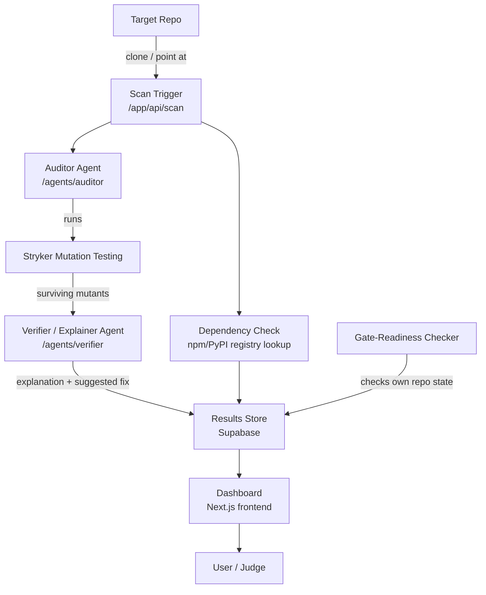

# Sentinel — Architecture Document

**Track:** B — Developer Productivity Tools
**Event:** Deploy or Die — HowToAlgo x GDG on Campus KIIT

---

## 1. Problem Statement

AI coding agents write code fast, including tests — but agent-written tests often *look*
thorough while not actually verifying real behavior. A test can assert something trivial,
mirror the implementation instead of testing it, or check a condition that could never
fail. The test suite goes green, coverage numbers look good, and a real bug ships anyway.
This is a known, current failure mode of agent-assisted development, and almost no
existing tool addresses it directly — most testing tools measure *coverage* (did a line
run?), not *effectiveness* (would a real bug have been caught?).

## 2. What Sentinel Does

Sentinel measures test **effectiveness**, not test coverage. It runs mutation testing
against a target repository — deliberately introducing small, targeted bugs ("mutants")
into the code, such as flipping a boolean condition or shifting a boundary value — then
checks whether the existing test suite actually fails when it should. If a mutant
"survives" (all tests still pass despite the bug), that's proof the corresponding test(s)
are hollow. Sentinel surfaces each surviving mutant with a plain-language explanation of
why the test suite missed it, and a suggested fix.

Additionally, Sentinel verifies every newly-added dependency in a codebase actually
exists on its package registry (npm/PyPI), catching hallucinated packages — another
known failure mode of AI-generated code — and provides a live dashboard that scores the
project's own repo against this hackathon's five gate requirements.

## 3. Goals and Non-Goals

**Goals (MVP / Tier 1):**
- Detect hollow tests via mutation testing on a JavaScript/TypeScript codebase
- Explain each gap in plain language and propose a concrete fix
- Detect hallucinated/non-existent package dependencies
- Provide a live, self-scoring gate-readiness dashboard
- Ship as a fully working, tested, documented product

**Non-goals (explicitly out of scope for MVP, revisited only as stretch):**
- Multi-language support beyond JS/TS (Python via mutmut is a stretch item)
- Auto-applying fixes without human review
- Spec-drift detection (code vs. rules-file compliance) — stretch only
- Cross-agent contradiction detection — stretch only

## 4. System Overview

## 5. Component Breakdown

### 5.1 Auditor Agent (`/agents/auditor`)
- **Input:** a target repository (path or URL)
- **Process:** invokes Stryker against the codebase, using its default mutation
  operators (conditional boundary, arithmetic, logical) scoped to changed/relevant files
  to keep scan time demo-friendly
- **Output:** a structured list of mutants, each tagged `killed` (a test caught it,
  working as intended) or `survived` (no test caught it — a real gap)
- **Design note:** this agent does not judge or explain — it only runs the mechanical
  process and reports raw results. Separation of "run the check" from "explain the
  result" is deliberate, mirroring a real audit/verification split.

### 5.2 Verifier / Explainer Agent (`/agents/verifier`)
- **Input:** the list of surviving mutants from the Auditor
- **Process:** for each surviving mutant, an LLM call (routed per the team's tool-routing
  table — Gemini Flash for volume, Gemini Pro/Claude for harder cases) generates a
  plain-language explanation of what the mutant changed, why the existing test(s) failed
  to catch it, and a concrete suggested fix or new test case
- **Output:** enriched, human-readable findings, never auto-applied — always requires
  human review before any code change (hard rule, see `AGENTS.md`)
- **Design note:** this agent is intentionally independent from the Auditor so its output
  can be evaluated for accuracy on its own — it never claims a mutant is "caught" unless
  Stryker's own output confirms it, avoiding fabricated results

### 5.3 Dependency Hallucination Check (`/lib` + scan pipeline)
- Scans new/changed imports and `package.json` entries
- Confirms each package name actually resolves on the npm registry (equivalent check for
  PyPI if Python support is added later)
- Flags any that don't resolve — a real, current risk from AI-generated code inventing
  plausible-sounding package names

### 5.4 Gate-Readiness Dashboard (`/app`, reading from `/docs`, `.github/workflows`, repo state)
- Checks, live, whether the repo currently satisfies the hackathon's five hard gate
  requirements: architecture doc present, `AGENTS.md` present, working code present,
  custom agent + skill documented in `AGENTS_AND_SKILLS.md`, CI green
- Displayed as a simple pass/fail checklist with live status
- Deliberately meta: Sentinel scores its own submission using the same rigor it applies
  to any codebase it audits

### 5.5 Results Store (Supabase / Postgres)
- Stores scan runs, mutant results, explanations, dependency-check results, and
  gate-readiness snapshots
- Enables the dashboard to show history, not just the latest scan

## 6. Data Flow (Happy Path)

1. User triggers a scan (via dashboard or CLI) against a target repo
2. Auditor agent runs Stryker, produces list of mutants (killed/survived)
3. Dependency check runs in parallel, produces list of unresolved packages (if any)
4. Verifier agent processes each surviving mutant, generates explanation + suggested fix
5. All results persisted to Supabase
6. Dashboard queries Supabase, renders results + updated gate-readiness status
7. Human reviews flagged items; any code changes are applied manually or via a
   human-approved PR — never auto-committed

## 7. Tech Stack (see `AGENTS.md` for full rationale)

| Layer | Choice | Why |
|---|---|---|
| Frontend + Backend | Next.js (App Router) + Tailwind | Single codebase/language, no separate backend service |
| Mutation testing | Stryker | Mature, JS/TS-native, no need to build mutation testing from scratch |
| DB | Supabase (Postgres) | Free tier, generous limits, simple integration |
| LLM providers | Gemini (AI Studio), NVIDIA Build, OpenRouter (fallback) | Free-tier, routed by task type per team's tool-routing plan |
| E2E testing | Playwright | Industry standard, integrates cleanly with GitHub Actions |
| CI/CD | GitHub Actions | Required by hackathon rules, native to GitHub |
| Deploy | Vercel | Free tier, native Next.js support |

## 8. Testing & Verification Strategy

- **Playwright e2e tests** cover the dashboard: triggering a scan, viewing results,
  gate-readiness status rendering correctly. Test report uploaded as a CI artifact on
  every run.
- **Sentinel's own mutation-test output**, run against its own codebase where practical,
  doubles as a demonstration of the product's core value applied to itself.
- **Linting** (ESLint + Prettier) enforced via pre-commit hook, not just CI — catches
  issues before they're even committed.

## 9. Security & Data Handling

- No secrets or API keys are ever committed; all held in `.env`, excluded via `.gitignore`
- LLM calls send only code diffs/snippets necessary for explanation — no unrelated
  repository data is transmitted
- All AI-suggested fixes require explicit human approval before being applied — no
  autonomous commits

## 10. Extensibility (Day 2 readiness)

The Auditor/Verifier split and the shared results store are intentionally generic enough
to extend without a rewrite:
- **Spec-drift detection** would reuse the Verifier agent's explanation pipeline, just
  fed a different comparison target (`AGENTS.md`/PRD vs. actual diff instead of
  mutant vs. test)
- **Cross-agent contradiction detection** would reuse the same results store, adding a
  provenance field (which agent/tool produced a given change) already compatible with
  the existing schema

This means a Day 2 surprise requirement is more likely to be an extension of existing
components than a rebuild.

## 11. Known Limitations (stated honestly)

- Mutation testing is inherently slower than standard test runs — the MVP scope keeps
  scans focused on a small, curated demo repository to stay fast and reliable live
- Single-language (JS/TS) support for MVP; multi-language is a stretch goal
- LLM-generated explanations, while grounded in Stryker's factual output, should still be
  human-reviewed before any suggested fix is applied